# Welcome to the Tulane Annotation Guide

Thank you for your participation in this multi-institutional study. This guide is intended for collaborators with Tulane University on studies involving annotation of whole-slide histopathology images. This guide will serve as both a tutorial on how to perform annotations in the annopath.tulane.edu platform, as well as guidance on how those annotations should be structured.

## User Account
You will have received a username and password for the annopath.tulane.edu platform. To login please follow the **Register or Log In** link in the top right of the home screen, as shown below.

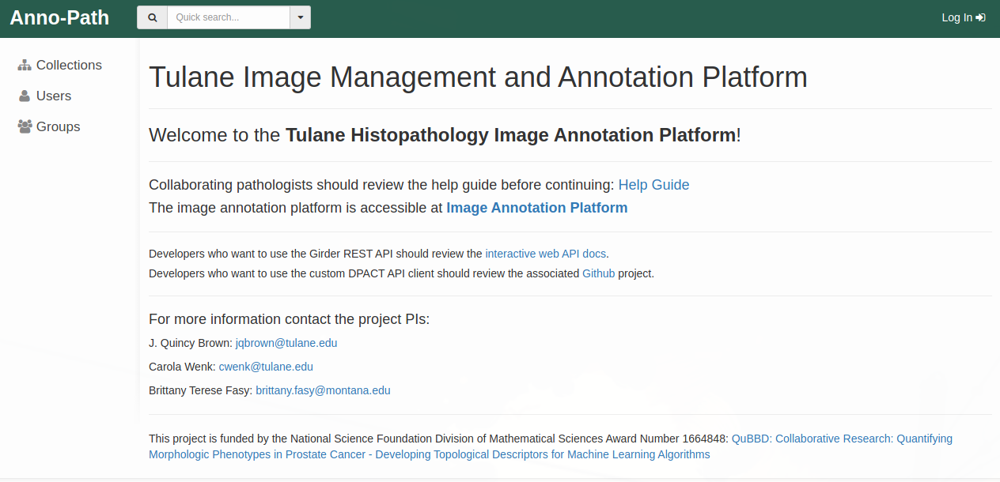

A login prompt will display, where you can login with your provided credentials. If you do not currently have credentials, or have forgotten your credentials, contact one of the project PIs.

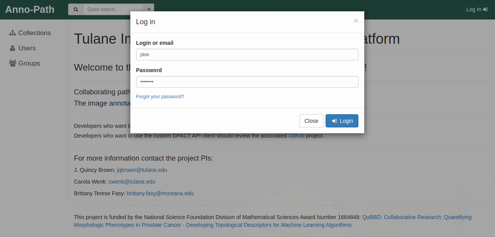

Upon successful login please follow the link to the **Image Annotation Platform**. If successful you will see a screen similar to that shown below:

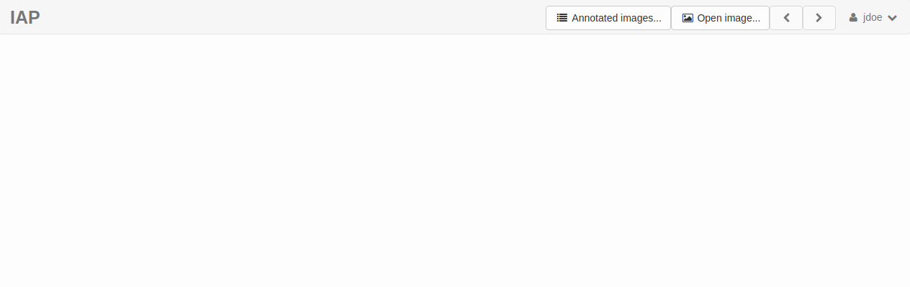

## Select an Image for Annotation

Select the **Open image..** prompt at the top of the header bar. A **Select a slide...** pop up prompt will open, as below:

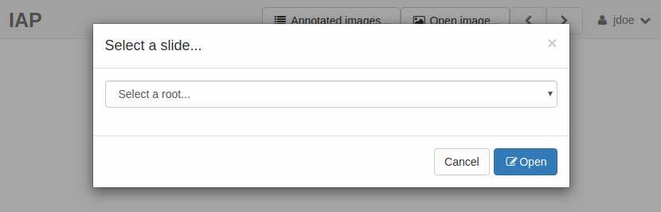

Begin by selecting the relevant collection of images you will be annotating. In this example we select **Prostatic Adenocarcinoma (PRAD)** cases, which contain images in folders by institution. Select the institution that you will be annotating images for. In this example we will select **Radboud** for University Medical Center Radboud. 

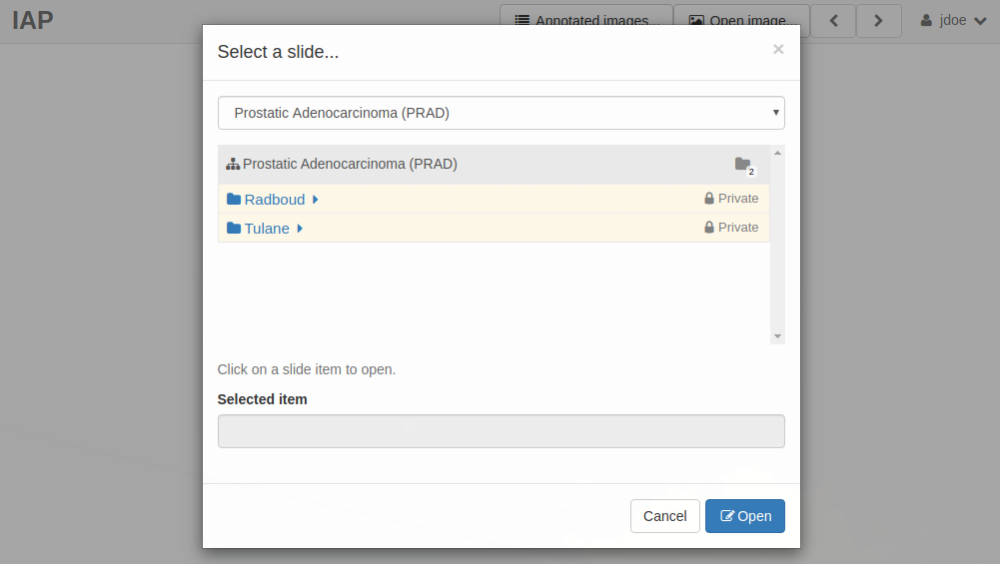

When selected, a thumbnail display of all images within that folder will display, as shown below:

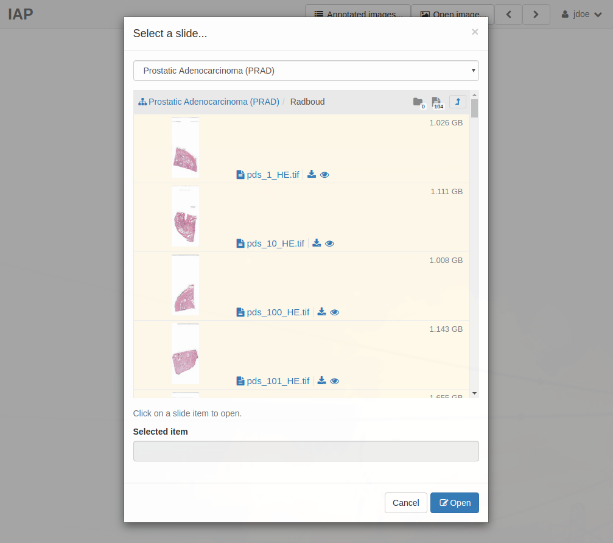

Select the first image you intend to annotate, then select **Open**. In this example, we will select the first image in the list, **pds_1_HE.tif**. This will open a whole-slide image viewer, as shown below: 

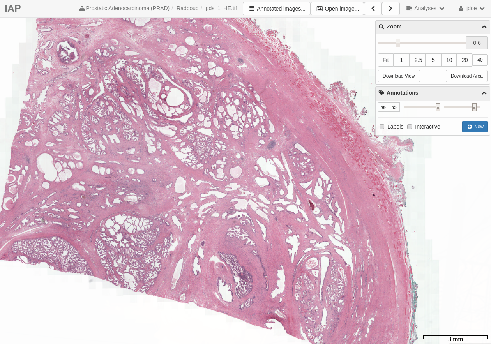

We are now ready to begin our first annotation!

## Annotating Images

In the **Annotations** toolbox (the second toolbox on the right of the screen) select **New**. This will open the **Create annotation** prompt below.

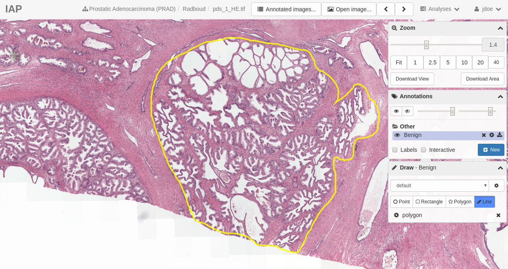

Each annotation actually represents a collection of annotations. In this way you can associate multiple annotations with the **Name** you provide. In this example we will create a **Benign** annotation, and then we will annotate multiple benign regions, which will be linked to that **Benign** annotation. This may seem confusing at first, but it will become clear with the following examples. First we type `Benign` into the **Name** field for the annotation. There is no need to provide additional description. Then select save to create an annotation collection called **Benign**. 

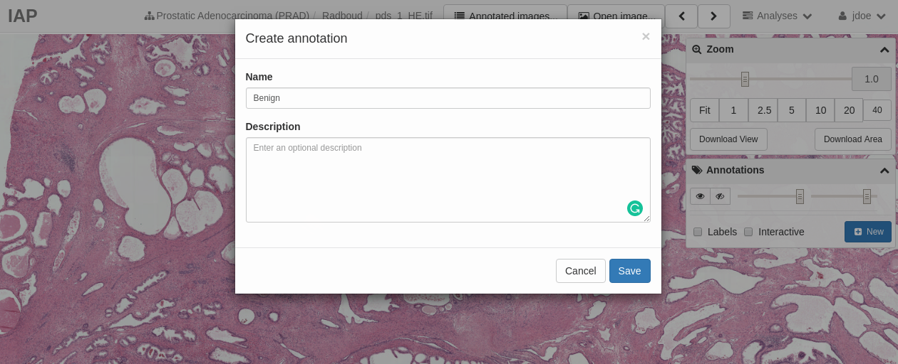

Once the **Benign** annotation collection is created you will see a new toolbox, **Draw**, appear as the third toolbox on the right of the screen, as shown below:

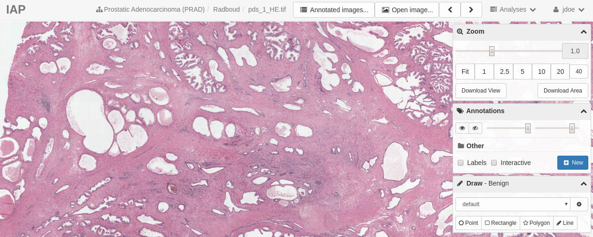

The **Draw** toolbox has four annotation options: **Point**, **Rectangle**, **Polygon**, and **Line**. We as that you restrict either **Polygon** or **Line**. If operating on a computer with a mouse or trackpad then **Polygon** will be the easiest to use. If you were issued a tablet and stylus for the study on which you are collaborating then **Line** will be the easiest to use. For this example we will assume you are using a tablet and stylus, and use **Line**. Select the **Line** option in the **Draw** toolbox. The **Line** field should be blue, and your cursor will have now switched from an arrow to a crosshair:

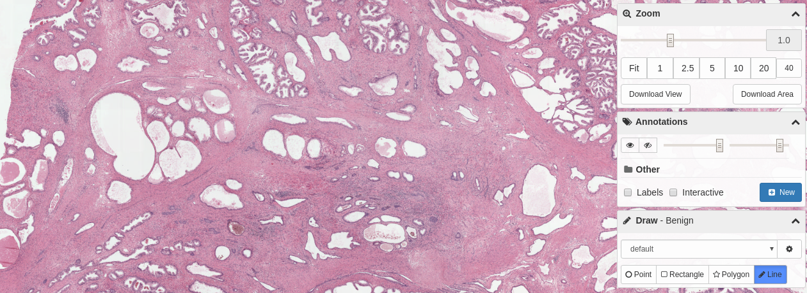
